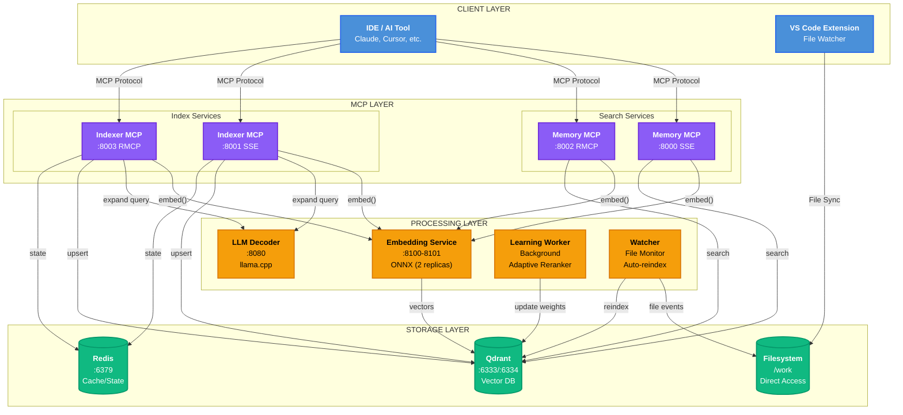

[](https://github.com/m1rl0k/Context-Engine/actions/workflows/ci.yml)
[](https://www.npmjs.com/package/@context-engine-bridge/context-engine-mcp-bridge)
[](https://marketplace.visualstudio.com/items?itemName=context-engine.context-engine-uploader)


**Documentation:** [Getting Started](docs/GETTING_STARTED.md) · README · [Configuration](docs/CONFIGURATION.md) · [IDE Clients](docs/IDE_CLIENTS.md) · [MCP API](docs/MCP_API.md) · [ctx CLI](docs/CTX_CLI.md) · [Memory Guide](docs/MEMORY_GUIDE.md) · [Architecture](docs/ARCHITECTURE.md) · [Multi-Repo](docs/MULTI_REPO_COLLECTIONS.md) · [Observability](docs/OBSERVABILITY.md) · [Kubernetes](deploy/kubernetes/README.md) · [VS Code Extension](docs/vscode-extension.md) · [Troubleshooting](docs/TROUBLESHOOTING.md) · [Development](docs/DEVELOPMENT.md)

---

## Context-Engine

Open-core, self-improving code search that gets smarter every time you use it.

---

## Quick Start

### Install the CLI

```bash
# Using pip
pip install context-engine

# Or using uv (recommended)
uv pip install context-engine
```

This installs the `ctx` command (also available as `ctx-cli`).

### One Command Setup

```bash
ctx quickstart
```

This single command starts all services, indexes your codebase, and warms up models.

### Common Commands

```bash
ctx status              # Check service health
ctx reset --mcp         # Reset with HTTP MCP endpoints (for Codex, modern clients)
ctx reset --mcp --db-reset  # Hard reset: wipe database and rebuild everything
ctx search "auth flow"  # Search your codebase
ctx answer "How does caching work?"  # Get answers with citations
```

See [ctx CLI Reference](docs/CTX_CLI.md) for all commands.

<details>
<summary><b>Legacy: Makefile Commands</b></summary>

The ctx CLI deprecates the Makefile, but legacy commands remain available:

```bash
git clone https://github.com/m1rl0k/Context-Engine.git && cd Context-Engine
make bootstrap  # Equivalent to: ctx quickstart
make reset      # Equivalent to: ctx reset --mcp
```

</details>

---

### Enterprise-Ready Features

- **Built-in authentication** with session management (optional)
- **Unified MCP endpoint** that combines indexer and memory services
- **Automatic collection injection** for workspace-aware queries

**Direct HTTP endpoints:**
```json
{
  "mcpServers": {
    "qdrant-indexer": { "url": "http://localhost:8003/mcp" },
    "memory": { "url": "http://localhost:8002/mcp" }
  }
}
```

*See [docs/IDE_CLIENTS.md](docs/IDE_CLIENTS.md) for MCP configuration examples and [docs/MCP_API.md](docs/MCP_API.md) for the complete API reference.*

---

## Agent Skills (Codex / Claude / Gemini / Augment)

Context-Engine includes agent skills that teach AI coding assistants how to use the MCP tools effectively.

**For Codex (OpenAI):**

Install directly from GitHub using the `$skill-installer`:
```
$skill-installer install https://github.com/Context-Engine-AI/Context-Engine/tree/main/.codex/skills/context-engine
```

Or copy manually:
```bash
# Global install
cp -r .codex/skills/context-engine ~/.codex/skills/

# Or project-specific
cp -r .codex/skills/context-engine /path/to/your/project/.codex/skills/
```

Restart Codex after installing to pick up the new skill.

**For Claude:**
```bash
cp CLAUDE.md /path/to/your/project/
```

**For Gemini:**
```bash
cp GEMINI.md /path/to/your/project/
```

**For Augment:**
```bash
cp -r .augment /path/to/your/project/
```

Skills teach agents to prefer Context-Engine MCP tools over grep/find/cat for code exploration.

---

## Architecture

### Local Mode
*Development and single-user deployment*



<details>
<summary><b>Service Port Reference</b></summary>

| Service | Port | Protocol | Description |
|---------|------|----------|-------------|
| Memory MCP (SSE) | 8000 | SSE | Legacy streaming transport |
| Memory MCP (RMCP) | 8002 | HTTP | Modern streamable HTTP |
| Indexer MCP (SSE) | 8001 | SSE | Legacy streaming transport |
| Indexer MCP (RMCP) | 8003 | HTTP | Modern streamable HTTP |
| Upload Service | 8004 | HTTP | Delta bundle uploads |
| Embedding Service | 8100-8101 | HTTP | ONNX embeddings (2 replicas) |
| LLM Decoder | 8080 | HTTP | llama.cpp query expansion |
| Qdrant | 6333/6334 | HTTP/gRPC | Vector database |
| Redis | 6379 | TCP | Cache and state backend |

</details>

---

## Benchmarks

### CoSQA (Dense Retrieval, No Rerank)

| Method | MRR | R@1 | R@5 | R@10 | NDCG@10 |
|--------|-----|-----|-----|------|---------|
| **Context-Engine (Jina-Code)** | **0.276** | 0.146 | 0.448 | 0.658 | 0.365 |
| Context-Engine (BGE-base) | 0.253 | 0.150 | 0.374 | 0.550 | 0.322 |
| CodeT5+ embedding | 0.266 | - | - | - | - |
| BM25 (Lucene) | 0.167 | - | - | - | - |
| BoW | 0.065 | - | - | - | - |

*Corpus: 20,604 code snippets | 500 queries | Pure dense retrieval, no reranking*
*Jina-Code: jinaai/jina-embeddings-v2-base-code (code-specific, 8k context)*

### CoIR Benchmark (Full Corpus, Dense Retrieval)

| Benchmark | Corpus | Queries | NDCG@10 |
|-----------|--------|---------|---------|
| **CodeSearchNet-Python** | 280K | 14.9K | **74.37%** |
| **CodeSearchNet-Go** | 280K | 14.9K | **74.51%** |
| **CodeSearchNet-JavaScript** | 280K | 14.9K | **57.19%** |

*Full CoIR corpus evaluation with dense retrieval (Jina-Code embeddings)*

---

## License

BUSL-1.1
